### Bài tập nhóm cuối kỳ
---
**Môn Nhập môn máy học (Machine Learning)**

**Yêu cầu:**
Description churn_rate_prediction.csv
- Apply all knowledge and techniques that you have learned for this
- You must organize your notebook based on the Homework
- Should not drop NA and missing value
Deadline:
- 3 weeks - (2023-06-25)

Data 2 (MLP -> Final)
Description Banking.csv
- Apply all knowledge and techniques that you have learned for this
- You must organize your notebook based on the Homework
- Should not drop Na, drop missing
- Models: compare all models that you have learned or practiced
- Can use pytorch & tensorflow
- Automl (should not use)

Deadline:
-  3-4 weeks - (2023-07-04)

**Nội dung**
1. Đọc hiểu dữ liệu churn_rate_prediction.csv
    Dữ liệu nhân khẩu học của khách hàng:
Thông tin của người vay.
- Loan_ID: Mã ID.
- Loan_Amount_Requested: Số tiền vay ngân hàng.
- Length_Employed: Thời gian làm việc tính bằng năm.
- Home_Owner: Tình trạng sở hữu nhà.
- Annual_Income: Thu nhập hàng năm.
- Income_Verified: Xác minh thu nhập.
- Purpose_Of_Loan: Mục đích sử dụng khoản vay.
- Debt_To_Income: Tỷ lệ nợ so với thu nhập.
- Inquiries_Last_6Mo: Số lần kiểm tra hỏi vay trong 6 tháng gần đây.
- Months_Since_Deliquency: Số tháng kể từ lần vi phạm nợ gần đây nhất.
- Number_Open_Accounts: Số tài khoản đang mở.
- Total_Accounts: Tổng số tài khoản tín dụng.
Gender: Giới tính.
Interest_Rate: Mức lãi suất của khoản vay.

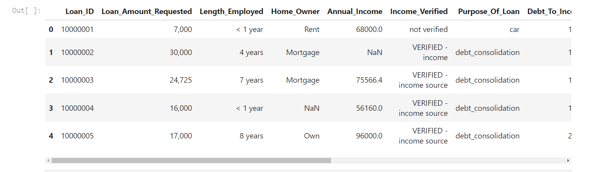

2. Khám phá Dữ liệu (Data Exploration)

- Xử lý dữ liệu sai định dạng: \
- Xử lý các giá trị như 'years','None',... để chuyển đổi thành NaN.
- Xử lý kiểu dữ liệu 'str,object' về định dạng kiểu số là int, float.
- Các giá trị -1 xuất hiện trong quá trình chuyển đổi các dữ liệu rời rạc về dạng kiểu int. Thay đổi các giá trị -1 này thành NaN.
2. Xử lý dữ liệu bị rỗng.
Xử lý NaN với kỹ thuật ước lượng bằng mô hình IterativeImputer.
3. Chọn các features Áp dụng lightgbm để tìm các features quan trọng 4. Loại bỏ các giá trị outliers.
Phương pháp z_score nhằm loại bỏ các giá trị liên tục.
Phương pháp IsolationForest 5. Xử lý phân phối.
Các features có giá trị liên tục có phân phối lệch trái.
Cần xử lý để các giá trị đạt gần phân phối chuẩn nhất bằng phương pháp boxcox transform.

    a. Xuất các thông tin heatmap 

   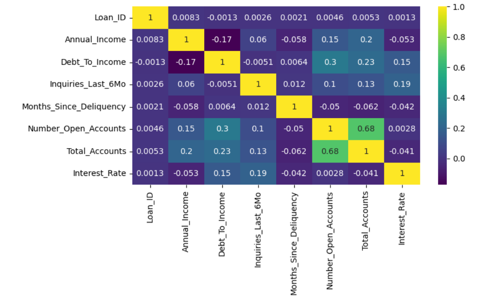

    b. Tiền xử lý Dữ liệu (Data Preprocessing)

      - Xử lý missing value 

    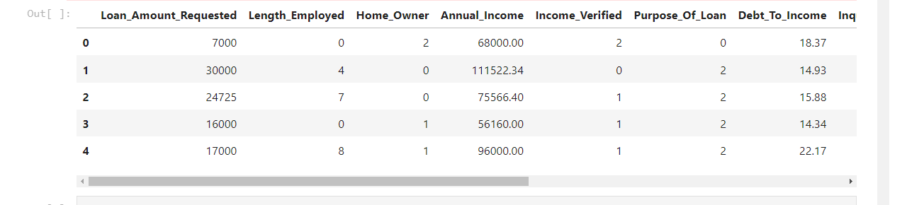

    c. Chọn các features bằng phương pháp lightgbm

    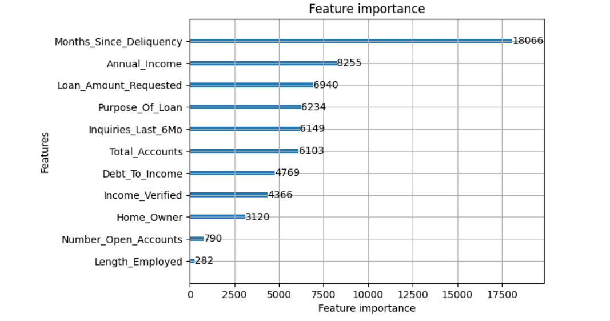

        - Các đồ thị thống kê 
    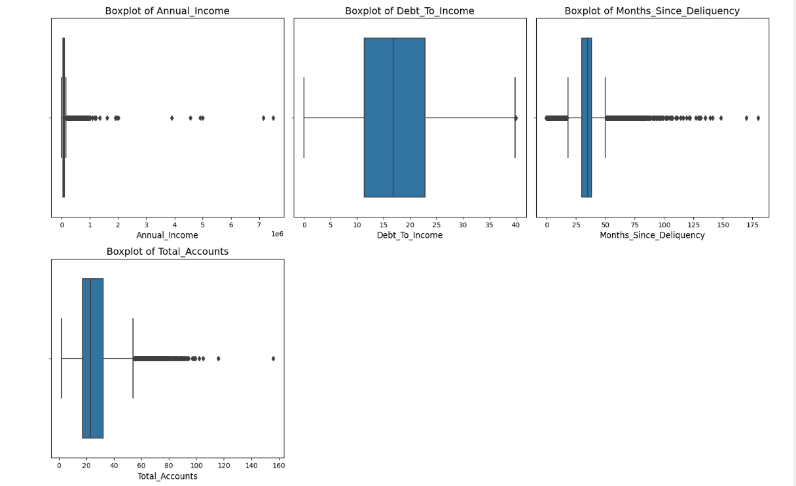

        - Xử lý outliers
    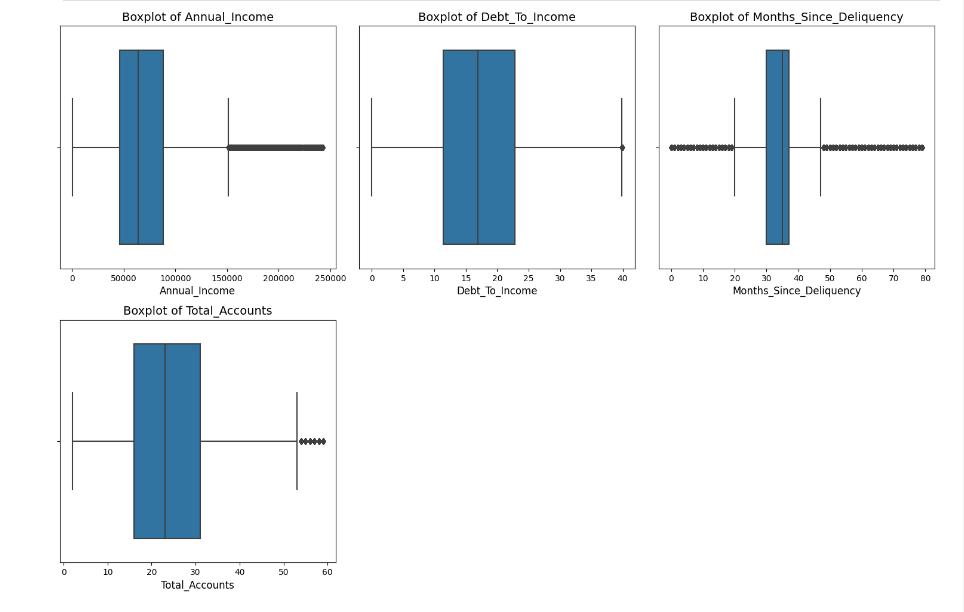

    - Với phương pháp IsolationForest

    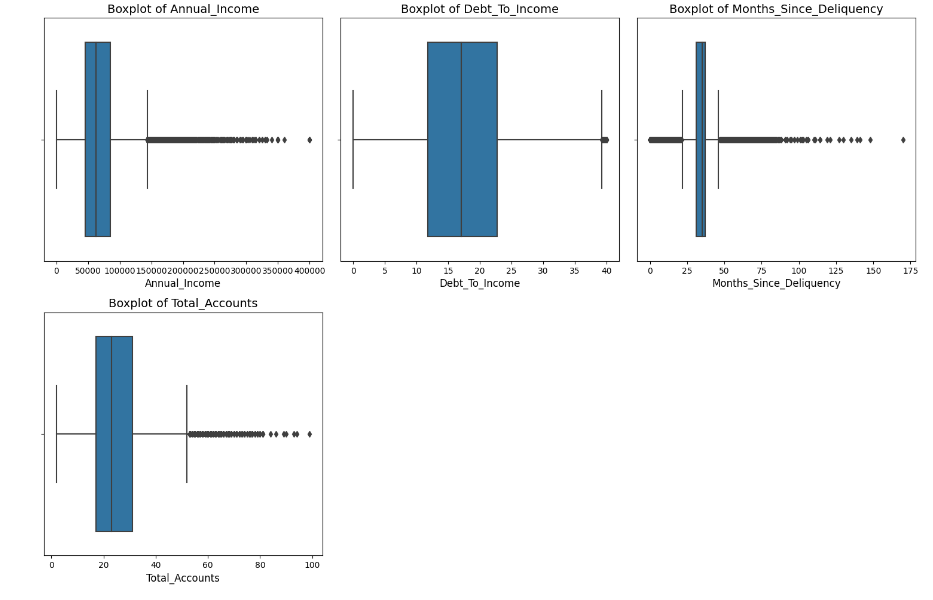

    - Kiểm tra phân phối 

    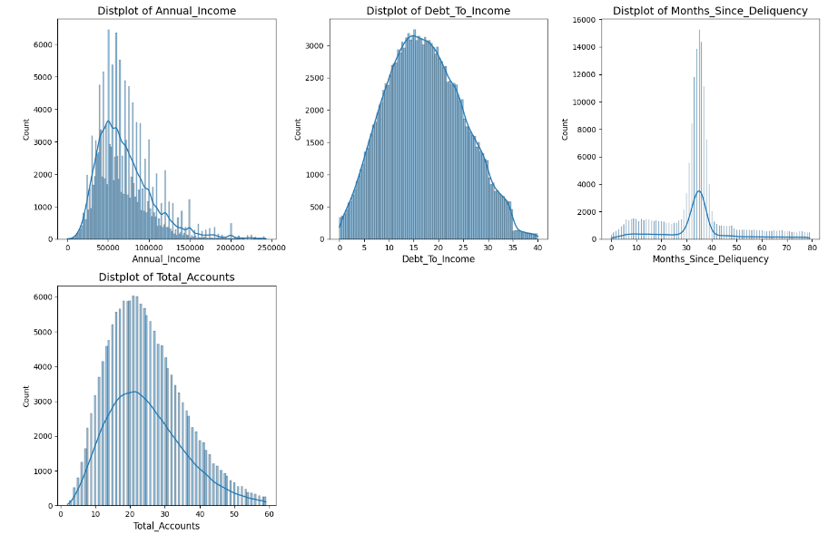

    d. Trực quan với Power Bi

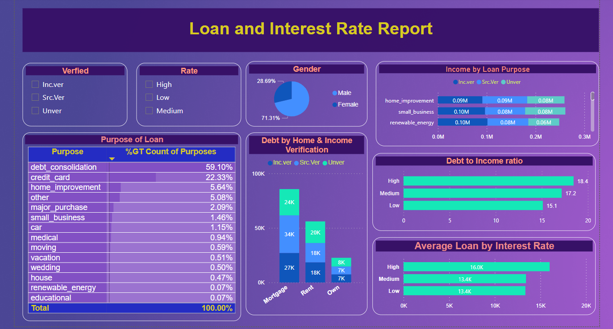

3. Xây dựng mô hình

- Xây dựng các mô hình gồm logistic regression,Naive Bayes, Decision trees, Random Forest, CatBoost, XGBoost, MLP

- Mô hình tốt nhất : XGBoost

    a. Đối với tập train

    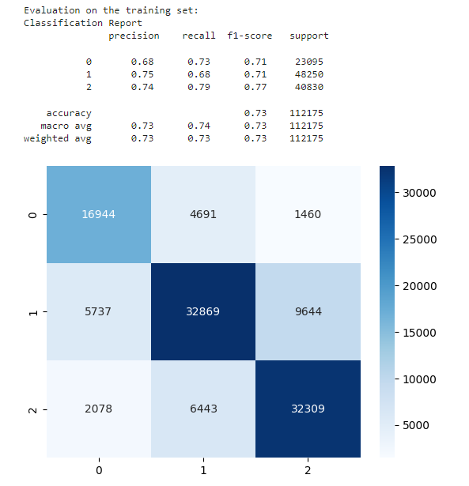

    b. Đối với tập test

    

- Nhận thấy giá trị dự đoán ở cả 2 tập train và test đều khá tương đồng nhau

- Thử nghiệm với Dataset khi không phụ thuộc vào lightgbm

    a. Đối với tập train của SVM

    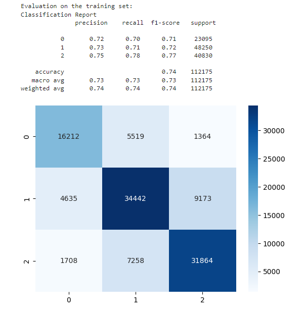
  
    b. Đối với tập test của SVM
    
    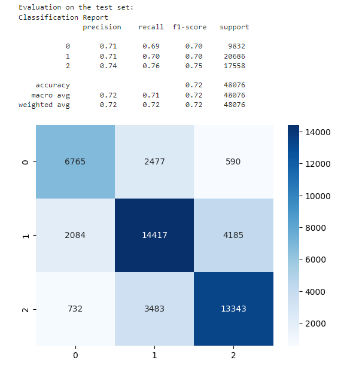
  
- Mô hình dự đoán tốt hơn

- Giữ lại các features cung cấp thêm thông tin. Điều này làm cải thiện recall và accuracy cho các mô hình
  
4. Đánh giá mô hình

    - Xử dụng Smote để xử lý vẫn đề imbalance các lớp trong target Interest_Rate. 
    - Thông qua recall, Vấn đề imbalance đã được cải thiện tốt. 

    - Các mô hình như RandomForest, Logistic, DecisionTree, NaiveBayes đều Underfiting với accuracy thấp mức 50%. Tình trạng imbalance cao mặc dù đã dùng SMOTE. 
    - Trong đó NaiveBayes tuy đạt giá trị thấp nhưng các giá trị trong recall đề gần bằng nhau. Điều này cho thấy NaiveBayes xử lý tương đối tốt khi dữ liệu imbalance.

5. Kết luận 
    - Quá trình xử lý dữ liệu đã hạn chế mất mát thông tin nhất có thể. 
    - Xử lý bộ dữ liệu đạt phân phối gần đạt chuẩn
    - Chưa thử nghiệm đánh giá và so sánh các kỹ thuật như PCA, Polynomial transform, Grid SearchCV, ...
    - Đối với mô hình SVM, chi phí thực hiện lớn nên chưa có kết quả thử nghiệm.
